# 爬虫逆向


本项目记录一些学习爬虫逆向的案例，仅供学习参考，请勿用于非法用途。

目前已完成：**rpc实现解密、工业和信息化部政务服务平台(加速乐)、极验滑块验证码、巨量算数、Boss直聘、企查查、中国五矿、qq音乐、产业政策大数据平台、企知道、天眼查、雪球网、1688、七麦数据、whggzy、企名科技、mohurd、艺恩数据、欧科云链(oklink)、企知道、度衍(uyan)、凤凰云智影院管理平台**


#### 环境安装：

npm install 

pip install -r requirements.txt


### 一、whggzy（接口参数）

#### 1.1 搜索响应数据找到接口

接口为 “http://www.whggzy.com/front/search/category”

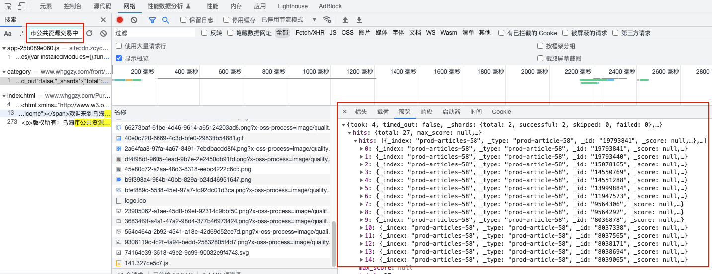


#### 1.2 设置header和data

将接口的headers和data传入，并进行测试

```python
headers = {
    # 这两个参数是必须的
    "User-Agent":"Mozilla/5.0 (Macintosh; Intel Mac OS X 10_15_7) AppleWebKit/537.36 (KHTML, like Gecko) Chrome/113.0.0.0 Safari/537.36",
    "Referer": "http://www.whggzy.com/PurchaseAdvisory/index.html",
}

# 通过查看参数发现data传的是字符串，所以这个通过字符串的方式发送data，而不是字典
data = {
    "categoryCode": "MostImportant",
    "pageNo": 1,
    "pageSize": 15
}
```

**访问后报错**


#### 1.3 断点调试

在源代码->xhr/提取断点中加入断点，观察到headers的参数，且data参数为字符串

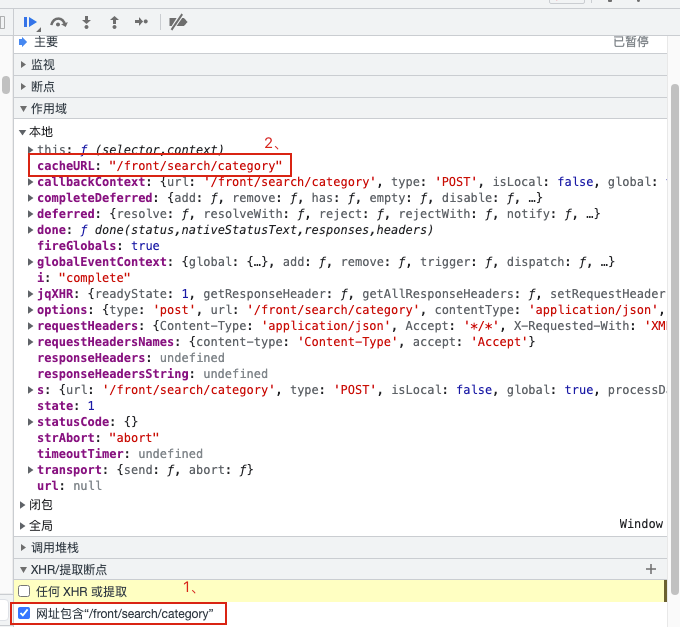


##### 完整代码

```python
import requests

url = "http://www.whggzy.com/front/search/category"

headers = {
    # 这两个参数是必须的
    "User-Agent":"Mozilla/5.0 (Macintosh; Intel Mac OS X 10_15_7) AppleWebKit/537.36 (KHTML, like Gecko) Chrome/113.0.0.0 Safari/537.36",
    "Referer": "http://www.whggzy.com/PurchaseAdvisory/index.html",

    # 通过xhr断点找到接口的headers包含一下几个
    'Accept': "*/*",
    'Content-Type': "application/json",
    'X-Requested-With': "XMLHttpRequest",


}

# 通过查看参数发现data传的是字符串，所以这个通过字符串的方式发送data，而不是字典
data = '''{
    "categoryCode": "MostImportant",
    "pageNo": 1,
    "pageSize": 15
}'''

print(requests.post(url, headers=headers, data=data).text)

```


### 二、企名科技(数据加密)

url: https://www.qimingpian.com/finosda/project/pinvestment

#### 2.1 搜索数据

搜索不到数据，判断为通过ajax数据加密

找到接口：

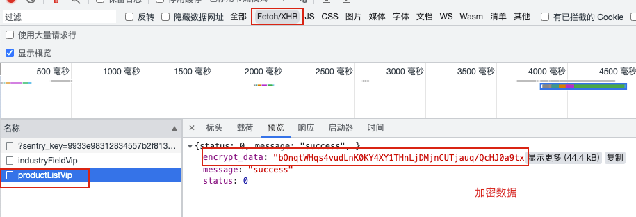


#### 2.2 断点调试

找到js文件

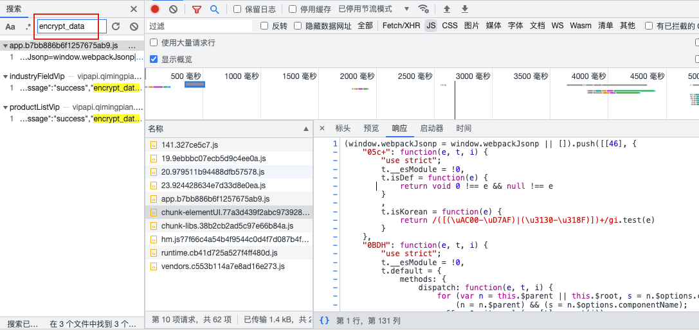


找到加密数据的方法：

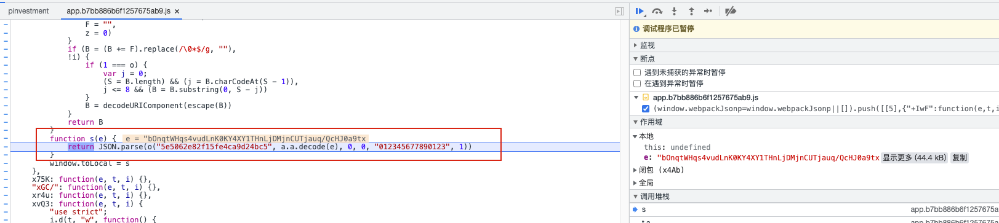


```js
// 还需要找到o方法和decode方法，整合成js文件
function s(e) {
    return JSON.parse(o("5e5062e82f15fe4ca9d24bc5", a.a.decode(e), 0, 0, "012345677890123", 1))
}
```


#### 2.3 调用接口获取数据，放入js方法中解密

```python
import json

import execjs
import requests

url = 'https://vipapi.qimingpian.cn/DataList/productListVip'

headers = {}

data = {}

# 打开js文件
with open("./demo2_qiming.js", "r") as f:
    jscode = f.read()

# 调用api接口拿到加密数据
resp = requests.get(url, headers=headers, data=data).json()

# 调用js文件
ctx = execjs.compile(jscode).call('s', resp["encrypt_data"])

print(ctx)
print(f"type:{type(ctx)}")
```


### 三、建筑(AES)

url： https://jzsc.mohurd.gov.cn/data/company


#### 3.1 获取数据

接口：https://jzsc.mohurd.gov.cn/APi/webApi/dataservice/query/comp/list?pg=0&pgsz=15&total=0


数据经过加密，data: 95780ba09437300...


#### 3.2 查找js

通过接口名称找到js文件，在js文件里搜索JSON.parse，打断点进行调试

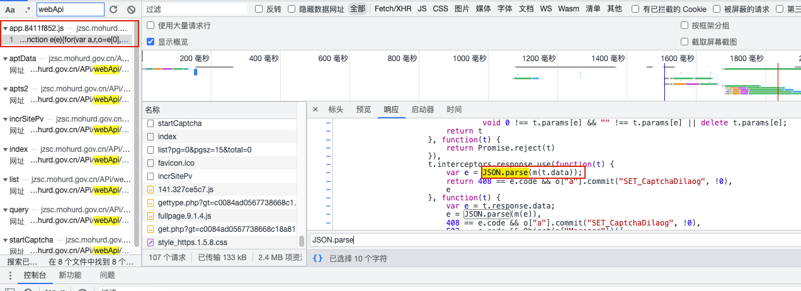


#### 3.3 js解密

常见js算法：crypto-js、jsdom、hash、md5、逆向算法

判断使用的加密是CryptoJS，使用npm安装库后导入，替换原始js里使用的方法

```js
const CryptoJS = require('crypto-js')
// 常见js算法：jsdom hash md5 逆向算法

function m(t) {
    // d.a是CryptoJS
    var f = CryptoJS.enc.Utf8.parse("jo8j9wGw%6HbxfFn")
    var h = CryptoJS.enc.Utf8.parse("0123456789ABCDEF")
    var e = CryptoJS.enc.Hex.parse(t),

        n = CryptoJS.enc.Base64.stringify(e),
        a = CryptoJS.AES.decrypt(n, f, {
            iv: h,
            mode: CryptoJS.mode.CBC,
            padding: CryptoJS.pad.Pkcs7
        }),
        r = a.toString(CryptoJS.enc.Utf8);
    return r.toString()
}
```


### 四、endata（js混淆）

url: https://www.endata.com.cn/BoxOffice/BO/Year/index.html

#### 4.1 获取数据

```python
url = "https://www.endata.com.cn/API/GetData.ashx"
headers = {}  # 略
data = {}  # 略
ori_data = requests.post(url, headers=headers, data=data).text

"""
out:
AFB3D177A5D1D916CFEFBE70FEFC0C59C0463AE137DE1A099C4B169B8AB9DBC33EE55B1...（加密数据）
"""
```


#### 4.2 搜索加密接口

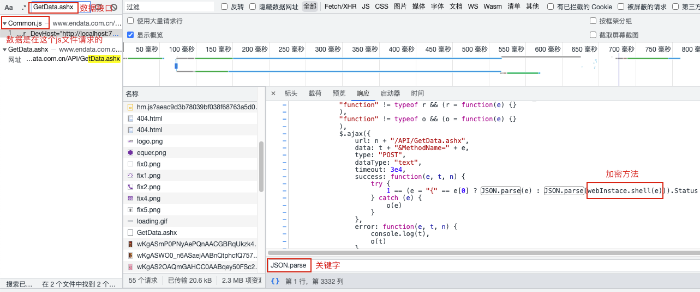


#### 4.3 js

通过断点找到加密的方法，方法经过了js混淆，直接复制方法，执行这个方法，根据提示补齐所有缺失的属性。

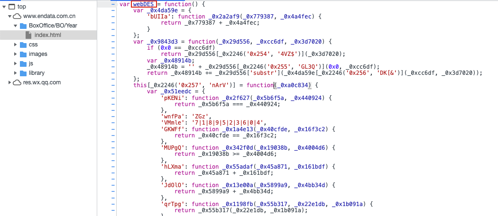


#### 4.4 navigator

js代码中存在一个navigator属性，为环境属性，需要手动写入

```js
global.navigator = {'userAgent': "node.js"}
```


#### 4.5 结合接口完成代码

```python
"""js混淆"""
import execjs
import requests

url = "https://www.endata.com.cn/API/GetData.ashx"
headers = {
"User-Agent":"Mozilla/5.0 (Macintosh; Intel Mac OS X 10_15_7) AppleWebKit/537.36 (KHTML, like Gecko) Chrome/113.0.0.0 Safari/537.36"

}
data = {
    "year": 2023,
    "MethodName": "BoxOffice_GetYearInfoData"
}
ori_data = requests.post(url, headers=headers, data=data).text

with open("./endata.js", 'r') as f:
    js_code = f.read()

result = execjs.compile(js_code).call("webInstace.shell", ori_data)

print(result)

# (webInstace.shell(data));

```


### 五、1688

url: https://sale.1688.com/factory/category.html?spm=a260k.22464671.home2019category.1.6e517a6exMGJcG&mainId=10166

#### 5.1 查看接口

有加密参数，找这个参数的js文件

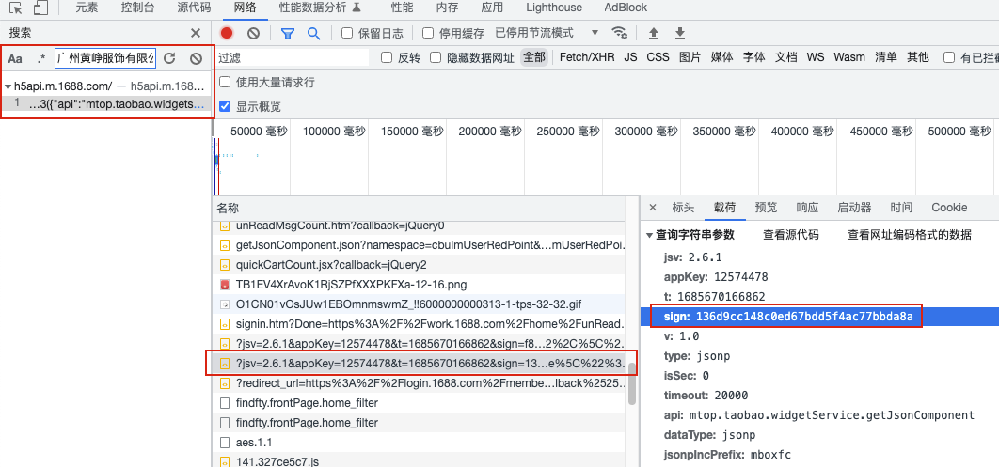

#### 5.2 搜索加密参数

**sign参数的组成：**token & 时间戳 & g & 请求参数，数据均没有变化

再经过h函数

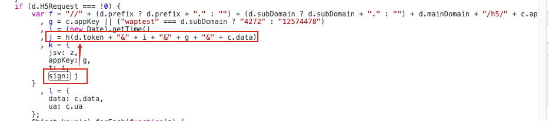


#### 5.3 得到sign

```python
# 请求的参数
data = '{"cid":"FactoryRankServiceWidget:FactoryRankServiceWidget","methodName":"execute","params":"{\\"extParam\\":{\\"methodName\\":\\"readRelatedRankEntries\\",\\"cateId\\":\\"10166\\",\\"size\\":\\"15\\",\\"pageNo\\":\\"1\\",\\"pageSize\\":\\"20\\",}}"}'

# sign = token & 时间戳 & g & 请求参数
token = "2a3e896698e27affa623d6ecd90aca5e"
i = int(time.time() * 1000)
g = "12574478"
# 拼接出字符串
j = f"{token}&{i}&{g}&{str(data)}"

# 使用js文件生成sign
with open("./h.js", "r", encoding="utf-8") as f:
    js_code = f.read()
sign = execjs.compile(js_code).call("h", j)

```


#### 5.4 访问接口

```python
# 设置header和params
headers = {
    "User-Agent": "Mozilla/5.0 (Macintosh; Intel Mac OS X 10_15_7) AppleWebKit/537.36 (KHTML, like Gecko) Chrome/113.0.0.0 Safari/537.36",
    "Referer": "https://sale.1688.com/",
    # 这里需要传入cookie，不然会提示token为空
    "Cookie":"...",
}
# 这里的data、时间戳要和sign里的data一样
params = {"jsv": "2.6.1", "appKey": "12574478", "t": str(i), "sign": sign, "v": "1.0", "type": "jsonp", "isSec": 0,
          "timeout": 20000, "api": "mtop.taobao.widgetService.getJsonComponent", "dataType": "jsonp",
          "jsonpIncPrefix": "mboxfc", "callback": "mtopjsonpmboxfc3", "data": data}

url = "https://h5api.m.1688.com/h5/mtop.taobao.widgetservice.getjsoncomponent/1.0/"
print(requests.get(url, headers=headers, params=params).text)
```


### 六、cninfo TODO

url: https://webapi.cninfo.com.cn/#/marketDataDate


#### 6.1 加密字段

为base64加密

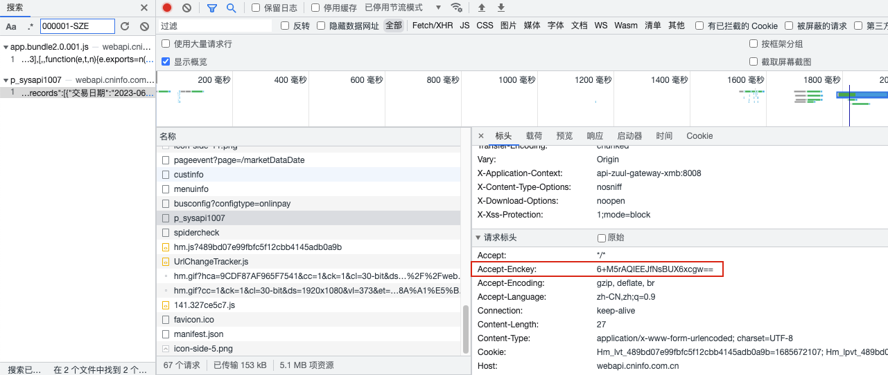


#### 6.2 搜索js文件

通过标头名或者路径搜索，找到js文件；该方法使用了js混淆。

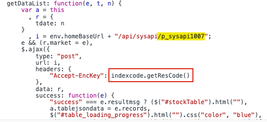


### 七、七麦数据（接口隐藏、js混淆）

url: https://www.qimai.cn/rank


#### 7.1找到接口

通过英文搜索到接口（中文有编码）

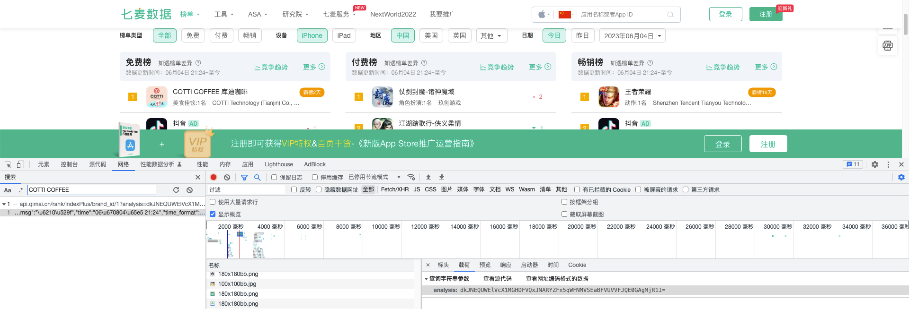

#### 7.2 搜索js文件

##### 找到js文件

接口的参数名搜索js，参数名：**analysis**，找到对应的js文件


##### 添加断点

在js文件中添加接口url的路径：/rank/indexPlus/brand_id/1


##### 单步调试找到加密位置

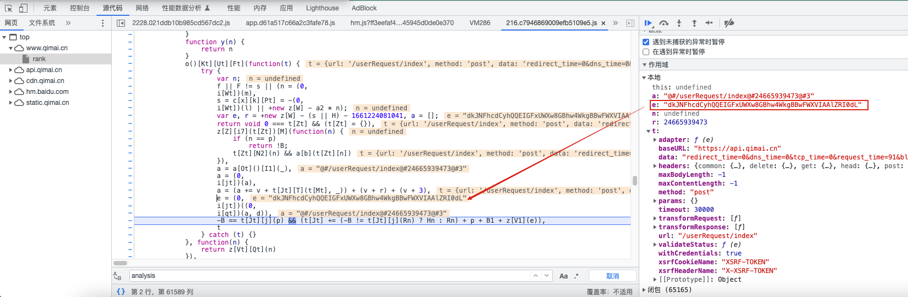


#### 7.3 编写js

js使用了js混淆，需要根据调试根据判断使用了什么方法，具体请看注解

```js
// 注释的代码为原始代码

function v(t) {
    // 找到这里使用的方法
    // t = z[V1](t)[T](/%([0-9A-F]{2})/g, function(n, t) {
    t = encodeURIComponent(t).replace(/%([0-9A-F]{2})/g, function (n, t) {
        // 这里的Y1是个固定字符
        // return o(Y1 + t)
        return o("0x" + t)
    });
    try {
        // boat方法
        // return z[Q1](t)
        return btoa(t)
    } catch (n) {
        // 找到这个方法
        // return z[W1][K1](t)[U1](Z1)
        return Buffer.from(t).toString("base64")
    }
}


function o(n) {
    let f2 = '66';
    let s2 = '72';
    let d2 = '6f';
    let m2 = '6d';
    let l2 = '43';
    let v2 = '68';
    let p2 = '61';
    let h2 = '64';
    let y2 = '65';
    t = "",

        [f2, s2, d2, m2, l2, v2, p2, s2, l2, d2, h2, y2].forEach(function (n) {
            t += unescape("%u00" + n)
        });
    var t, e = t;
    // 调试时这里的e一直是undefined，通过打断点再调试确定为这个方法
    // return z[b2][e](n)
    return String.fromCharCode(n)
}

function h(n, t) {
    t = t || u();
    // 替换方法和值
    // for (var e = (n = n[$1](_))[R], r = t[R], a = q1, i = H; i < e; i++)
    for (var e = (n = n.split("")).length, r = t.length, a = "charCodeAt", i = 0; i < e; i++)
        n[i] = o(n[i][a](0) ^ t[(i + 10) % r][a](0));
    // return n[I1](_)
    return n.join("")
}

function url(pass) {
    var s = 1359
    var H = 0
    var e, r = +new Date() - (s || H) - 1661224081041, a = [];
    var v1 = "@#"
    // 固定值
    var d = "xyz517cda96abcd"

    // a = a[Ot]()[I1](_),
    a = a.sort().join("")

    // 这里调用了一个去掉域名的方法，但我们传的是后面的接口路径，所以直接使用
    // a = (a += v + t[Jt][T](t[Mt], _)) + (v + r) + (v + 3),
    a = (a += v1 + pass) + (v1 + r) + (v1 + 3)

    // 在调试工具里找到这两个方法，复制到上面
    // e = (0,
    //     i[jt])((0,
    //     i[qt])(a, d))
    e = (0,
        v)((0,
        h)(a, d))
    return e
}

const pass = "/rank/indexPlus/brand_id/1"
console.log(url(pass));
```


### 八、oklink

#### 8.1 查看接口

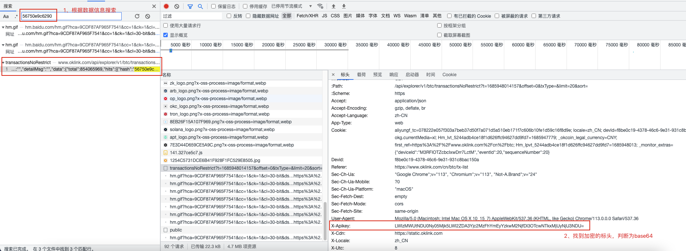


#### 8.2 搜索js文件


##### 找到加密的位置

找到方法，再进行搜索

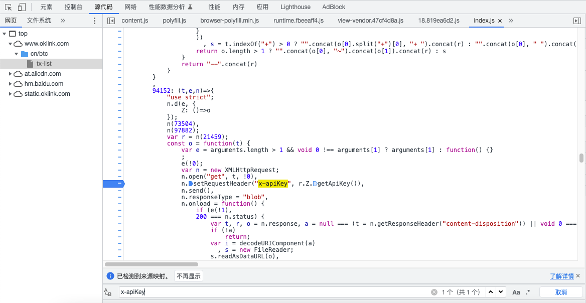


#### 8.3 js实现

找到webpack打包的代码，改写后补齐所有方法

##### 原代码

```js
{
    key: "encryptApiKey",
    value: function() {
        var t = this.API_KEY
          , e = t.split("")
          , n = e.splice(0, 8);
        return t = e.concat(n).join("")
    }
}, {
    key: "encryptTime",
    value: function(t) {
        var e = (1 * t + a).toString().split("")
          , n = parseInt(10 * Math.random(), 10)
          , r = parseInt(10 * Math.random(), 10)
          , o = parseInt(10 * Math.random(), 10);
        return e.concat([n, r, o]).join("")
    }
}, {
    key: "comb",
    value: function(t, e) {
        var n = "".concat(t, "|").concat(e);
        return window.btoa(n)
    }
}, 
{
    key: "getApiKey",
    value: function() {
        var t = (new Date).getTime()
          , e = this.encryptApiKey();
        return t = this.encryptTime(t),
        this.comb(e, t)
    }
}
```


##### 改写

```js
function encryptApiKey() {
    let API_KEY = "a2c903cc-b31e-4547-9299-b6d07b7631ab"
    var t = API_KEY
        , e = t.split("")
        , n = e.splice(0, 8);
    return t = e.concat(n).join("")
}

function encryptTime(t) {
    let a = 1111111111111
    var e = (1 * t + a).toString().split("")
        , n = parseInt(10 * Math.random(), 10)
        , r = parseInt(10 * Math.random(), 10)
        , o = parseInt(10 * Math.random(), 10);
    return e.concat([n, r, o]).join("")
}

function comb(t, e) {
    var n = "".concat(t, "|").concat(e);
    return Buffer.from(n).toString("base64")
}

function getApiKey() {
    var t = (new Date).getTime()
        , e = encryptApiKey();
    return t = encryptTime(t),
        comb(e, t)
}

getApiKey()
```


#### 8.4 python代码实现

```python

def get_api_key():
    """获取加密字符串"""
    times = int(time.time() * 1000)

    # 固定的加密值
    api_key = "a2c903cc-b31e-4547-9299-b6d07b7631ab"

    # encryptApiKey()
    key1 = api_key[0:8]
    key2 = api_key[8:]
    # 交换位置
    new_key = key2 + key1

    # encryptTime()
    a = 1111111111111

    new_time = str(1 * times + a)
    random1 = str(random.randint(0, 9))
    random2 = str(random.randint(0, 9))
    random3 = str(random.randint(0, 9))
    # 拼接
    cur_time = new_time + random1 + random2 + random3

    # 合并前面生成的两个值，并用base64加密
    this_key = new_key + "|" + cur_time
    n_k = this_key.encode("utf-8")
    x_apikey = base64.b64encode(n_k)
    return x_apikey
```


### 九、去哪儿机票服务

url:https://m.flight.qunar.com/h5/flight/

#### 8.1、接口的加密

8.1.1、请求参数：**\_\_m\_\_**

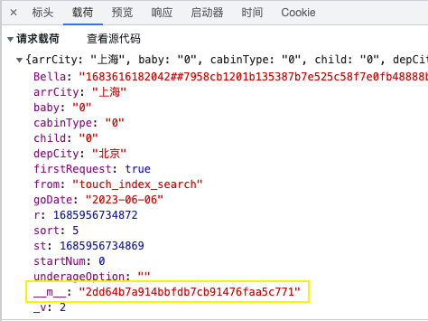

8.1.2、请求头参数：**键值对加密**

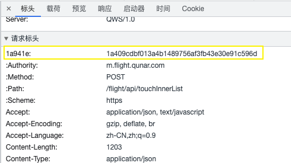

#### 8.2、请求参数

##### 8.2.1 通过js查找算法	

f()为**md5**加密

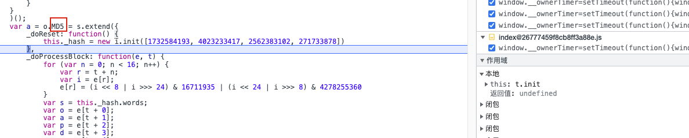


u()为**SHA1**加密

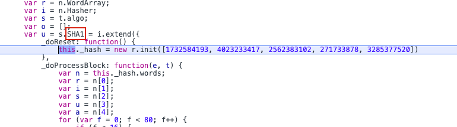

##### 8.2.2 js代码解析

```js
// 所有方法

// 加密算法
function encryptFunction() {
    /**
     * 调试进入这两个算法中，找到他们对应的算法，找关键字，例如算法名称
     * f：md5
     * n: SHA1
     */
    return [function (e) {
        // t % 2 == 0执行这个方法
        // e = t时间戳 + n字符串
        var t = (0,
            u.default)(e).toString();
        return (0,
            f.default)(t).toString()
    }
        // t % 2 == 1执行这个方法
        , function (e) {
            var t = (0,
                f.default)(e).toString();
            return (0,
                u.default)(t).toString()
        }
    ]
}

function dencryptCode(t) {
    return t.map(function (e) {
        return String.fromCharCode(e - 2)
    }).join("")
}

function getQtTime(t) {
    /*
    * 如果有t这里直接返回t
    * 没t这里把时间戳分割后的char值-2转为字符串
    */
    return t ? Number(t.split(",").map(function (e) {
        return String.fromCharCode(e - 2)
    }).join("")) : 0
}

// 获取字符串方法
function getTokenStr() {
    var t = this.dencryptCode(this.tokenStr);
    // 这里选择了页面中一个id为t的元素的值
    var n = document.getElementById(t).innerHTML;
    // 这里会返回元素的值或者方法的值
    return n ? n : (0,
        s.default)(this.dencryptCode(this.cookieToken))
}


// 获取参数的方法
function encrypt() {
    // t是页面元素的值
    var t = this.getTokenStr()
        // 这里n是时间戳
        , n = this.getQtTime((0,
        s.default)(this.dencryptCode(this.qtTime)))
        // r是对时间戳取模
        , r = n % 2;
    return encryptFunction()[r](t + n)
}

// 加密的方法
function encryptToken(t) {
    return (0,
        f.default)(t).toString()
}
```


##### 8.2.3 python生成该参数

根据前面解析js代码，得到m参数的生成逻辑

```python
import hashlib
import time

def md5_hash(text):
    # 创建MD5哈希对象
    md5_hasher = hashlib.md5()
    # 更新哈希对象以包含待加密的文本
    md5_hasher.update(text.encode('utf-8'))
    # 返回MD5加密后的结果
    return md5_hasher.hexdigest()

def sha1_hash(text):
    # 创建SHA1哈希对象
    sha1_hasher = hashlib.sha1()
    # 更新哈希对象以包含待加密的文本
    sha1_hasher.update(text.encode('utf-8'))
    # 返回SHA1加密后的结果
    return sha1_hasher.hexdigest()


def get_m():
    # .data["__m__"] = u.default.encryptToken(u.default.encrypt());
    # 获取需要被加密的参数，即u.default.encrypt()

    # 页面存储的token"00008a002f1051a169b06202"
    t = "00008a002f1051a169b06202"
    # 时间戳
    n = int(time.time() * 1000)
    # n = 1686020493263
    # 时间戳取余
    r = n % 2

    p1 = t + str(n)

    # 根据r决定先用SHA1还是MD5
    if r == 0:
        # SHA1
        p1 = sha1_hash(p1)
        # MD5
        p1 = md5_hash(p1)
    else:
        # MD5
        p1 = md5_hash(p1)
        # SHA1
        p1 = sha1_hash(p1)
    # 最后再用一次MD5加密
    p1 = md5_hash(p1)

    return p1

# fbc1646d57a2b22ceb5f5ef60018f67d
print(get_m())
```


#### 8.3、请求头参数

##### 8.3.1 js代码解析

```js
// 生成key的方法，传入的参数是时间戳
function getRandomKey(t) {
    var n = "";
    // 从时间戳的第四位开始截取
    var r = ("" + t).substr(4);
    // 时间戳每一位映射的acsii编码
    r.split("").forEach(function (e) {
        n += e.charCodeAt()
    });
    // md5加密
    var i = (0,
        f.default)(n).toString();
    // -6:
    return i.substr(-6)
}

// headers的主要生成方法
function getToken() {
    // dict
    var t = {};
    // this.getQtTime((0,s.default)(this.dencryptCode(this.qtTime))) 依然是时间戳
  	// value是__m__参数一样的加密方法
    t[this.getRandomKey(this.getQtTime((0,
        s.default)(this.dencryptCode(this.qtTime))))] = this.encrypt();
    return t
}
```

##### 8.3.2 python实现

```python
def get_random_key(t):
    """ 获取请求头参数的key """
    # 截取4开始的字符串
    t = str(t)[4:]
    n = ""
    # 转为ascii编码并拼接
    for i in t:
        n += str(ord(i))
    # md5解密
    key = md5_hash(n)
    # 返回最后6位
    return key[-6:]


def get_headers():
    """ 获取请求头参数 键值对"""
    t = int(time.time() * 1000)
		# 获取key
    key = get_random_key(t)
    # 获取值
    value = get_m(t)
    return {key:value}
```


### 十、美团

url: https://gz.meituan.com/meishi/

#### 10.1、接口的加密

_token为加密参数。

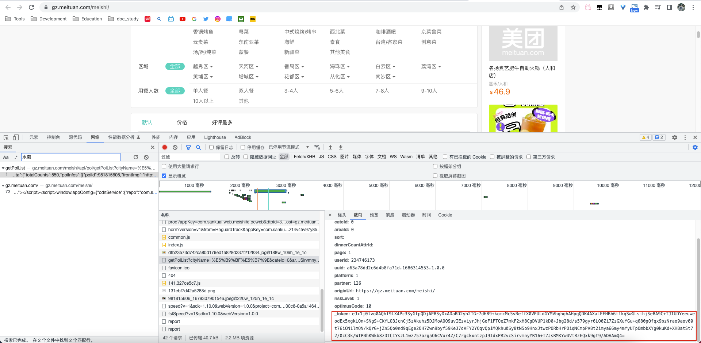


#### 10.2、查找js

查找到token的生成位置，找到加密的方法

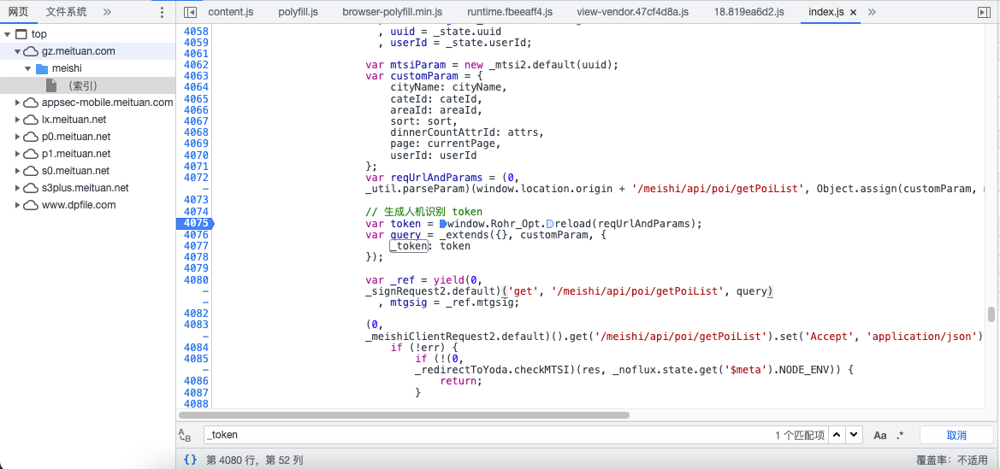


#### 10.3、生成参数

_token参数为iP类进行加密后得到的，但目前只能得出iP的sign参数，对iP进行加密后没办法得到最终的值，**如果你知道怎么做欢迎提交issue给我**。


**iP.sign**为参数排序后进行base64加密。

```python
def decode_sign(token_str):
    token_str = token_str.replace(" ", "")

    # base编码
    # token_str = f"\"{str(token_str)}\""
    # token_str = str(token_str)
    # token_str = f"'{token_str}'"

    print(f"str:::{token_str}")

    encode1 = str(token_str).encode()
    # 参数 压缩成 特殊的编码
    compress = zlib.compress(encode1)
    b_encode = base64.b64encode(compress)
    # 转变 str
    e_sign = str(b_encode, encoding="utf-8")
    return e_sign
  
# 查询参数
params = {
    'cityName': '广州',
    'cateId': 0,
    'areaId': 0,
    'sort': '',
    'dinnerCountAttrId': '',
    'page': 1,
    'userId': '234746173',
    'uuid': 'cab1469b7bd84ca09ea5.1686484028.1.0.0',
    'platform': 1,
    'partner': 126,
    'originUrl': 'https://gz.meituan.com/meishi/',
    'riskLevel': 1,
    'optimusCode': 10
}

# 生成sign
params_str =  "\""
# 对key进行排序
keys = [i for i in params.keys()]
keys.sort()
# 拼接
for key in keys:
    params_str += f"{key}={params.get(key)}&"
params_str = params_str[:-1]
params_str += "\""
# 加密
sign = decode_sign(params_str)

# iP
iP = {
    'rId': 100900,
    'ver': "1.0.6",
    # 'ts': 1686369166338,
    # 'cts': 1686369167064,
    "ts":1686485181487,
    "cts":1686485200311,
    'brVD': [
        1920,
        150
    ],
    'brR': [
        [
            1920,
            1080
        ],
        [
            1920,
            981
        ],
        30,
        30
    ],
    'bI': [
        'https://gz.meituan.com/meishi/',
        ''
    ],
    'mT': [],
    'kT': [],
    'aT': [],
    'tT': [],
    'aM': '',
    'sign': sign
}
```


### 十一、天安财险

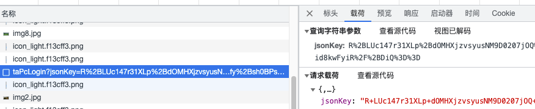

- 完成登陆请求中的json_key参数加密方法
- 解析返回的接口

 [tianaw.js](2023-6_before/tianaw.js)


### 十二、企知道（2023-7-23：反debug、AES加密、逆向）

url：https://patents.qizhidao.com/


#### 12.1 反debug

这个网站的反debug是带参数的，直接设置跳过会导致返回不了结果卡死。需要通过脚本返回空的值，注意：需要等页面加载后再执行。

```js
func_constructor_ = Function.prototype.constructor;
Function.prototype.constructor = function (a) {
    if (a == 'debugger') {
        return function(){};
    }
    return func_constructor_(a);
};
```

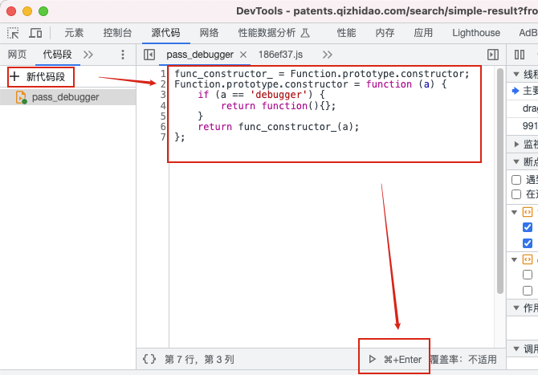


#### 12.2、构造请求接口

复制接口的cURL到https://curlconverter.com/自动构造，代码有点长这里只放片段：

```python
import requests

cookies = {
    # ...
}

headers = {
    'authority': 'app.qizhidao.com',
  	# ...
}

json_data = {
    'text_ver': 'N',
    # ...
    'statement': '华为',
    'filter': '',
    'pageCount': 21073,
    'checkResult': True,
}

response = requests.post(
    'https://app.qizhidao.com/qzd-bff-patent/patent/simple-version/search',
    cookies=cookies,
    headers=headers,
    json=json_data,
).json()

# 返回结果：
# {'code': 0, 'status': 0, 'success': True, 'msg': '成功', 'data1': 'ikEaI3qCl29i...', 'hasUse': 2}
```


#### 12.3 解密

##### 12.3.1 参数解释

**data1**：这个是加密后的参数，需要解密。AES加密

**hasUse**：加密的key的位置。key是个字典，2代表第二个value


##### 12.3.2 查找加密js

- 搜索”encrypt“


- 搜索接口

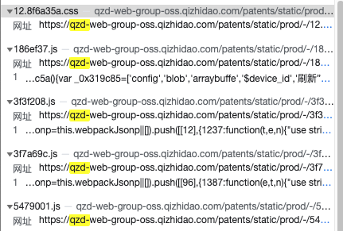

> 交集在**186ef37.js**


##### 12.3.3 断点调试

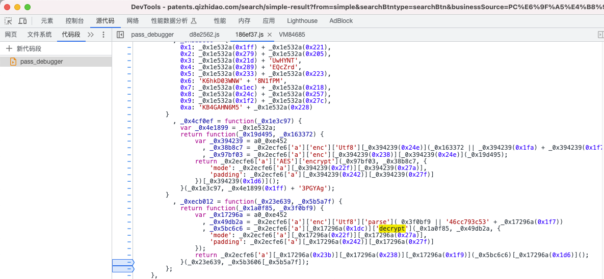

```js
// 第一个参数是密文，第二个参数是加密的key
// AES加密
_0xecb012 = function(_0x23e639, _0x5b5a7f) {
            return function(_0x1a0f85, _0x3f0bf9) {
                var _0x17296a = a0_0xe452
                  , _0x49db2a = _0x2ecfe6['a']['enc']['Utf8']['parse'](_0x3f0bf9 || '46cc793c53' + _0x17296a(0x1f7))
                  , _0x5bc6c6 = _0x2ecfe6['a'][_0x17296a(0x1dc)]['decrypt'](_0x1a0f85, _0x49db2a, {
                    // 加密模式是ECB
                    'mode': _0x2ecfe6['a'][_0x17296a(0x22f)][_0x17296a(0x27a)],
                    'padding': _0x2ecfe6['a'][_0x17296a(0x242)][_0x17296a(0x27f)]
                });
                return _0x2ecfe6['a'][_0x17296a(0x23b)][_0x17296a(0x238)][_0x17296a(0x1f9)](_0x5bc6c6)[_0x17296a(0x1d6)]();
            }(_0x23e639, _0x5b3606[_0x5b5a7f]);
```


通过观察发现key不是固定的，存储在一个字典中。通过接口返回的值hasUse选择对应的key。

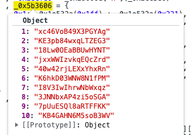

#### 12.4  构造解密函数

```python
def AES_decrypt(data, hasUse:int):
    key_list = [b"xc46VoB49X3PGYAg", b"KE3pb84wxqLTZEG3", b"18Lw0OEaBBUwHYNT", b"jxxWWIzvkqEQcZrd", b"40w42rjLEXxYhxRn",
                b"K6hkD03WNW8N1fPM", b"I8V3IwIhrwNbWxqz", b"3JNNbxAP4zi5oSGA", b"7pUuESQl8aRTFFKK", b"KB4GAHN6M5soB3WV"]
    # 解码
    html = base64.b64decode(data)
    # mode为ECB的AES加密
    aes = AES.new(key_list[hasUse-1], AES.MODE_ECB)
    # 解密
    info = aes.decrypt(html)
    # 填充
    decrypt = unpad(info, AES.block_size).decode()
    return decrypt
```


#### 12.5 结果

[完整代码](./other/demo3_qizhidao/crawler_qizhidao.py)

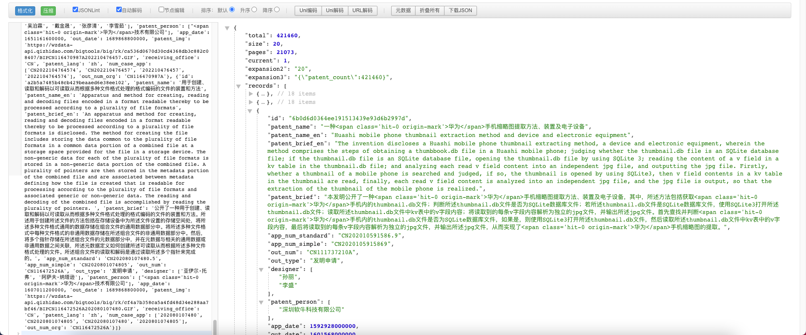


### 十三、空气质量指数（反debug）

url：https://www.aqistudy.cn/historydata/monthdata.php?city=%E5%8C%97%E4%BA%AC

#### 13.1 反debug

##### 13.1.1 跳过debug

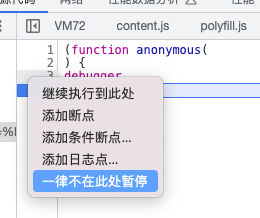

##### 13.1.2 弹出开发者工具

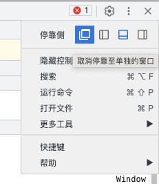

#### 13.2 请求参数解析

通过js生产请求参数

 [aqi.js](2023-6_before/aqi.js) 

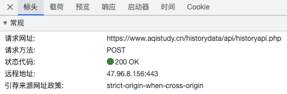


# 案例_2023-7


## 一、阿里系cookie加密（acw_sc__v2 ）

#### 1、请求

有两次请求，第一次获取js代码，第二次通过代码生成参数发送请求

尝试本地替换，发现没有进入方法。是在VM中执行的


#### 2、查找js代码

##### 2.1 打断点，查看堆栈

进入debug，可以看到调用的位置，打断点调试，**进入堆栈中的方法**。

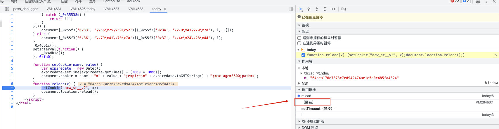


##### 2.2 找到参数

参数是**arg2**，查找这个参数。

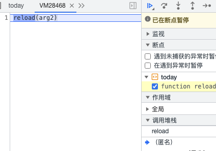


##### 2.3 找生成参数的js代码

返回原代码，找到生成arg2的代码，把混淆的代码还原。通过对比，只有arg1值是不固定的，在第一次请求中就包含了这个值，通过正则提取，传入js代码里生成就可以得到cookie。

```js
String['prototype']['hexXor'] = function (_0x4e08d8) {
    var _0x5a5d3b = '';
    for (var _0xe89588 = 0x0; _0xe89588 < this['length'] && _0xe89588 < _0x4e08d8['length']; _0xe89588 += 0x2) {
        var _0x401af1 = parseInt(this['slice'](_0xe89588, _0xe89588 + 0x2), 0x10);
        var _0x105f59 = parseInt(_0x4e08d8['slice'](_0xe89588, _0xe89588 + 0x2), 0x10);
        var _0x189e2c = (_0x401af1 ^ _0x105f59)['toString'](0x10);
        if (_0x189e2c['length'] == 0x1) {
            _0x189e2c = '\x30' + _0x189e2c;
        }
        _0x5a5d3b += _0x189e2c;
    }
    return _0x5a5d3b;
}

String['prototype']['unsbox'] = function () {
    var _0x4b082b = [0xf, 0x23, 0x1d, 0x18, 0x21, 0x10, 0x1, 0x26, 0xa, 0x9, 0x13, 0x1f, 0x28, 0x1b, 0x16, 0x17, 0x19, 0xd, 0x6, 0xb, 0x27, 0x12, 0x14, 0x8, 0xe, 0x15, 0x20, 0x1a, 0x2, 0x1e, 0x7, 0x4, 0x11, 0x5, 0x3, 0x1c, 0x22, 0x25, 0xc, 0x24];
    var _0x4da0dc = [];
    var _0x12605e = '';
    for (var _0x20a7bf = 0x0; _0x20a7bf < this['length']; _0x20a7bf++) {
        var _0x385ee3 = this[_0x20a7bf];
        for (var _0x217721 = 0x0; _0x217721 < _0x4b082b['length']; _0x217721++) {
            if (_0x4b082b[_0x217721] == _0x20a7bf + 0x1) {
                _0x4da0dc[_0x217721] = _0x385ee3;
            }
        }
    }
    _0x12605e = _0x4da0dc['join']('');
    return _0x12605e;
}

function get_cookie(arg1) {

    // 这个值是变化的
    // var arg1 = 'E7FC4E89FD5A4E550E19A8BE2061BD16BE4C0DB3';

    var _0x23a392 = arg1['unsbox']();

    var _0x5e8b26 = '3000176000856006061501533003690027800375'
// arg2 = _0x23a392[_0x55f3('0x1b', '\x7a\x35\x4f\x26')](_0x5e8b26);
    arg2 = _0x23a392['hexXor'](_0x5e8b26);

    return arg2
}

console.log(get_cookie('E7FC4E89FD5A4E550E19A8BE2061BD16BE4C0DB3'));
```


#### 3、发起请求、生成cookie

[代码](2023-7/day2_cookie加密等/spider_xueqiu/ali.py)

```python
import re

import execjs
import requests

headers = {
# ...
}

# 获取到第一次请求的值，返回生成cookie的代码，里面包含了需要的参数 arg1
response = requests.get('https://xueqiu.com/today', headers=headers).text

# with open("./ali.html", 'w', encoding='utf-8') as f:
#     f.write(response)

# 正则提取arg1的值
# Regular expression pattern to match the argument assignment
pattern = r"var arg1='([A-F0-9]+)';"

# Search for the pattern in the JavaScript code
arg1 = re.search(pattern, response).group(1)

with open("./xueqiu.js") as f:
    js_code = f.read()

cookie_acw_sc__v2 = execjs.compile(js_code).call("get_cookie", arg1)
print(cookie_acw_sc__v2)

cookies = {
    'acw_sc__v2': cookie_acw_sc__v2,
		# ...
}

headers = {
 #...
}

response = requests.get('https://xueqiu.com/today', cookies=cookies, headers=headers).text
print(response)

```


## 二、产业政策大数据平台（带参数的反debug、进制流加密）

http://www.spolicy.com/


#### 1.1 查看调用堆栈，找到第一个方法

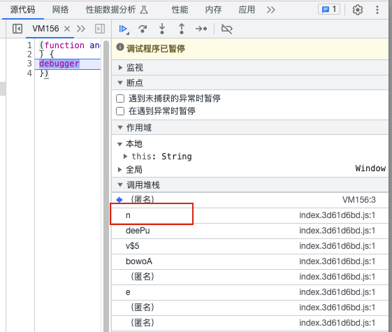

```js
// 调用的方法
[f(-302, -39, -274, -178, "mK8a") + o(430, 0, "sXA$") + "r"](t[c(-294, "o#Hz", 0, -62)](t[h(1402, 1326, 1439, "wJdL")], t[h(1596, 1182, 1426, "2QAW")]))[c(-180, "mK8a", 0, -159)](t[h(1113, 950, 1143, "Es!I")])

// 逐步拆解

[f(-302, -39, -274, -178, "mK8a") + o(430, 0, "sXA$") + "r"]
// => ['constructor']

(t[c(-294, "o#Hz", 0, -62)](t[h(1402, 1326, 1439, "wJdL")], t[h(1596, 1182, 1426, "2QAW")]))
// => debugger

[c(-180, "mK8a", 0, -159)]
// => call

(t[h(1113, 950, 1143, "Es!I")])
// => action
```


#### 1.2执行脚本跳过debugger

```js
func_constructor_ = Function.prototype.constructor;
Function.prototype.constructor = function (a) {
    if (a == 'debugger') {
        return function(){};
    }
    return func_constructor_(a);
};
```

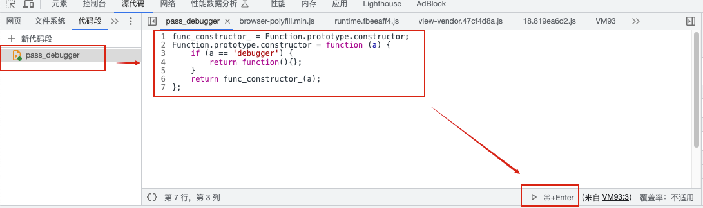


#### 1.3 XHR断点找到接口

xhr中添加接口的路径：**/info_api/policyType/showPolicyType**


找到**interceptors.response.use**的位置，返回的结果中存在了加密数据**data**。

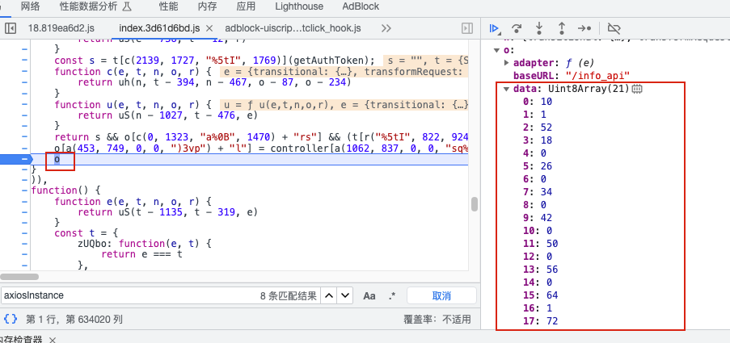


#### 1.4 找生成的方法，生成加密方法

找到生成o的位置：

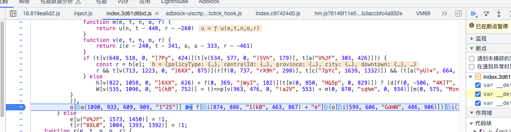


找到生成的方法：

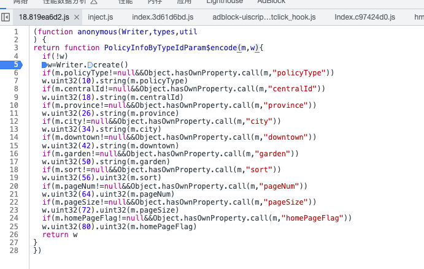


这里缺少了Writer，断点进入，这个代码是在vm中的生成的，找到函数的位置，扣下来完整的代码，用变量接收：

```js
var writer_;
commonjsGlobal = global;
!function (g) {
    var r, e, t, i;
    r = {...},
        e = {},
        t = [16],
        i = function t(n) {
            var o = e[n];
            return o || r[n][0].call(o = e[n] = {
                exports: {}
            }, t, o, o.exports),
                o.exports
        }(t[0]),
        i.util.global.protobuf = i,
    module && module.exports && (module.exports = i)
    // 方法存放在i变量中
    writer_ = i;
}()


function PolicyInfoByTypeIdParam_encode(m, w) {
    if (!w)
        w = writer_.Writer.create()
    if (m.policyType != null && Object.hasOwnProperty.call(m, "policyType"))
        w.uint32(10).string(m.policyType)
    if (m.centralId != null && Object.hasOwnProperty.call(m, "centralId"))
        w.uint32(18).string(m.centralId)
    if (m.province != null && Object.hasOwnProperty.call(m, "province"))
        w.uint32(26).string(m.province)
    if (m.city != null && Object.hasOwnProperty.call(m, "city"))
        w.uint32(34).string(m.city)
    if (m.downtown != null && Object.hasOwnProperty.call(m, "downtown"))
        w.uint32(42).string(m.downtown)
    if (m.garden != null && Object.hasOwnProperty.call(m, "garden"))
        w.uint32(50).string(m.garden)
    if (m.sort != null && Object.hasOwnProperty.call(m, "sort"))
        w.uint32(56).uint32(m.sort)
    if (m.pageNum != null && Object.hasOwnProperty.call(m, "pageNum"))
        w.uint32(64).uint32(m.pageNum)
    if (m.pageSize != null && Object.hasOwnProperty.call(m, "pageSize"))
        w.uint32(72).uint32(m.pageSize)
    if (m.homePageFlag != null && Object.hasOwnProperty.call(m, "homePageFlag"))
        w.uint32(80).uint32(m.homePageFlag)
    return w
}


/**
 * 接收类型和页号，返回请求所需的参数
 * @param type 类型，str
 * @param page 页号，int
 * @returns {*} 加密后的数据，字典格式，数据在"data"
 */
function get_data(type, page) {
    var data = {
        "policyType": type,
        "province": "",
        "city": "",
        "downtown": "",
        "garden": "",
        "centralId": "",
        "sort": 0,
        "homePageFlag": 1,
        "pageNum": page,
        "pageSize": 7
    }
    result = PolicyInfoByTypeIdParam_encode(data).finish().slice()

    return result;
}

console.log(get_data("3", 1))
```


#### 1.5 携带加密参数发起请求

```python
import execjs
import requests

cookies = {
    # 略
}

headers = {
    'Accept': 'application/json, text/plain, */*',
    # ... 略
}

with open("./spolicy.js") as f:
    js_code = f.read()

# 获取type4的，第一页的请求加密参数
data = execjs.compile(js_code).call("get_data", "4", 1)
print(data)

response = requests.post(
    'http://www.spolicy.com/info_api/policyType/showPolicyType',
    cookies=cookies,
    headers=headers,
    # 转为bytes
    data=bytes(data["data"]),
    verify=False,
).json()

print(response)

```


## 三、中国五矿（单文件webpack）

url：https://ec.minmetals.com.cn/open/home/purchase-info

#### 1、接口解析

每次请求都有两个接口，**public**获取公钥，用于后面加密参数；**by-lx-page**是数据接口，参数param是加密后的请求参数

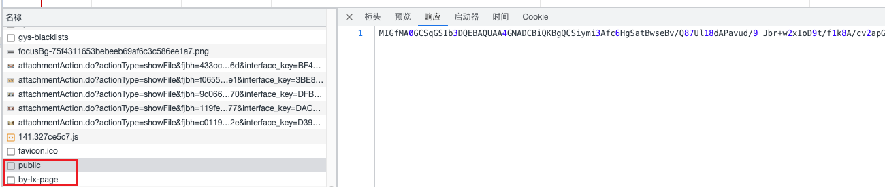


#### 2、解密js

##### 2.1、搜索**/open/homepage/public**（public公钥接口路径）找到js文件位置

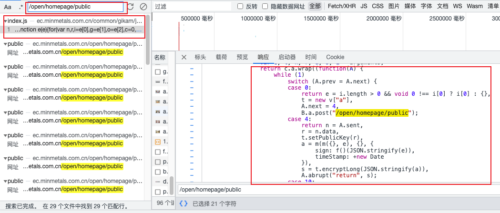

##### 2.2、在生成位置找到加载器

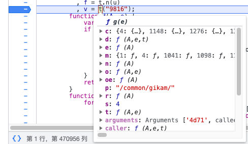

##### 2.3、只要加载器部分，下面的函数可以只复制需要的

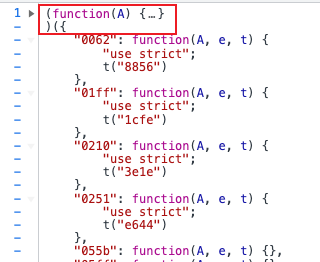

##### 2.4、补充需要的模块，在这里搜索9816，复制到代码中

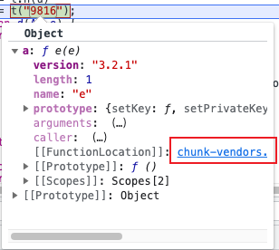

##### 2.5、运行时报错，原因是缺少模块，打印出e，看看报错前的模块名，补充模块

```shel
/minmetals.js:52
return A[e].call(t.exports, t, t.exports, g),
                        ^
TypeError: Cannot read property 'call' of undefined

```

##### 2.6、之后补齐所有代码，有两个部分是变化的，**public**公钥和**e**请求参数部分，后续通过python传入

```js
// ....其他代码省略
function get_param(public_key, param) {
    // public_key
    r = public_key
    // e: params
    e = param
    t.setPublicKey(r),
        a = m(m({}, e), {}, {
            // 这里是md5加密，不用扣代码了，直接写一个
            sign: md5Hash(JSON.stringify(e)),
            timeStamp: +new Date
        });
    s = t.encryptLong(JSON.stringify(a))
    return s
}

// 公钥
r = 'MIGfMA0GCSqGSIb3DQEBAQUAA4GNADCBiQKBgQCSiymi3Afc6HgSatBwseBv/Q87Ul18dAPavud/9Jbr+w2xIoD9t/f1k8A/cv2apGmPwKnudecWa5IfXPVUvoqjG8GsTBR9kL4QKkBveZx46wx2KZEBSbjx9Ok92hgr6sCEHT4sO53VF6rhzYJ4WaqsugGdL3CrZEGV3x7MuvZ0tQIDAQAB'
// 请求参数
e = {
    "inviteMethod": "",
    "businessClassfication": "",
    "mc": "",
    "lx": "ZBGG",
    "dwmc": "",
    "pageIndex": 1
}
get_param(r, e)
```


#### 3、编写程序

分为两个步骤，1是获取public公钥，2是将参数和公钥进行加密，发起请求

```python
import execjs
import requests
# 获取public
import requests

cookies = {
    # ...
}
headers = {
    # ...
}

# 获取public_key
public_key = requests.post('https://ec.minmetals.com.cn/open/homepage/public', cookies=cookies, headers=headers).text
print(public_key)


# 获取parms加密参数
with open("./minmetals.js") as f:
    js_code = f.read()

param = {
    "inviteMethod": "",
    "businessClassfication": "",
    "mc": "",
    "lx": "ZBGG",
    "dwmc": "",
    "pageIndex": 2
}
param = execjs.compile(js_code).call("get_param", public_key, param)

json_data = {
    'param': param
}

response = requests.post(
    'https://ec.minmetals.com.cn/open/homepage/zbs/by-lx-page',
    cookies=cookies,
    headers=headers,
    json=json_data,
).json()

print(response)
```


## 四、QQ音乐

url:https://y.qq.com/n/ryqq/search

#### 1、接口解析

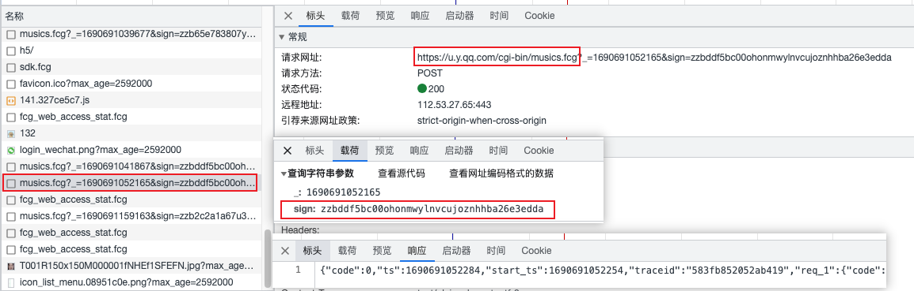

接口中**sign**参数为加密参数


#### 2、还原js

##### 2.1、搜索sign找到js文件

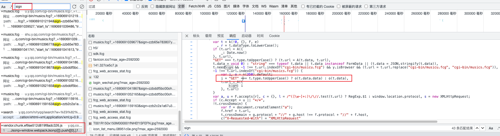


##### 2.2、加密的方法是o()，找到o的生成位置

 **加载器**

n为加载器，把n的代码复制（webpack）

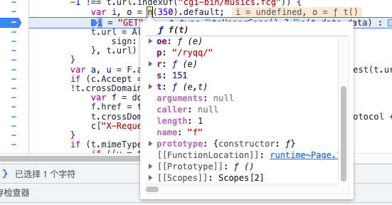


```js
var loader_;
!function(e) {
  // ...
  // f是加载器，用全局变量接收
  loader_ = f;
}([])
```


**加载器方法**

这里是具体方法，把整个代码复制，在原来的代码中导入

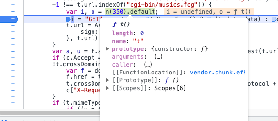

```js
// 加载这个方法的所有代码
require("module")
var loader_;
!function(e) {
  // ...
  // f是加载器，用全局变量接收
  loader_ = f;
}([])
```


##### 2.3、测试

使用相同的参数，网页中返回的加密参数值为："zzb5f83fe81ctmp7buyrgfgmht5hfggeb4159a0"

```js
// ....

// 对比和网页的加密结果是否一致
origin_result = "zzb5f83fe81ctmp7buyrgfgmht5hfggeb4159a0"
result = loader_(350).default(t_data)

// 并不一致
// zzb5f83fe81ctmp7buyrgfgmht5hfggeb4159a0
// zzb2938d59cvfb4kyj1do3c4ldgj6o9qe0f41793
```


##### 2.4、补充环境

加密方法是一样的，但是结果不一样，考虑是环境的问题，补充一些环境再测试

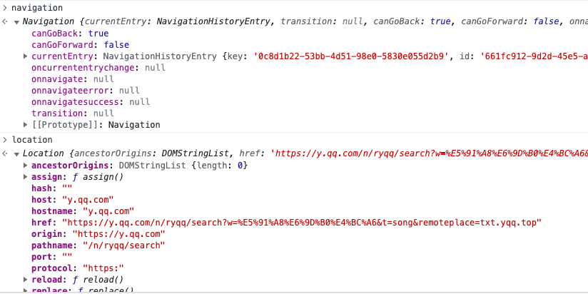

```js
navigator = {
    canGoBack: true,
    canGoForward: false,
    currentEntry: {
        "id": "661fc912-9d2d-45e5-a144-fae79c979d88",
        "index": 5,
        "key": "0c8d1b22-53bb-4d51-98e0-5830e055d2b9",
        "ondispose": null,
        "sameDocument": true,
        "url": "https://y.qq.com/n/ryqq/search?w=%E5%91%A8%E6%9D%B0%E4%BC%A6&t=song&remoteplace=txt.yqq.top"
    },
    "oncurrententrychange": null,
    "onnavigate": null,
    "onnavigateerror": null,
    "onnavigatesuccess": null,
    "transition": null
}
location = {
    "ancestorOrigins": {},
    "href": "https://y.qq.com/n/ryqq/search?w=%E5%91%A8%E6%9D%B0%E4%BC%A6&t=song&remoteplace=txt.yqq.top",
    "origin": "https://y.qq.com",
    "protocol": "https:",
    "host": "y.qq.com",
    "hostname": "y.qq.com",
    "port": "",
    "pathname": "/n/ryqq/search",
    "search": "?w=%E5%91%A8%E6%9D%B0%E4%BC%A6&t=song&remoteplace=txt.yqq.top",
    "hash": ""
}
// ....

console.log("zzb5f83fe81ctmp7buyrgfgmht5hfggeb4159a0");
console.log(loader_(350).default(t_data));

//zzb5f83fe81ctmp7buyrgfgmht5hfggeb4159a0
//zzb5f83fe81ctmp7buyrgfgmht5hfggeb4159a0
```


#### 3、编写代码

```python
import time

import execjs
import requests

# cookies和headers一定要正确才能请求到
cookies = {
    # ...
}

headers = {
  # ...
}

# 请求参数
singer = "周杰伦"
page_num = 1
data = '{"comm":{"cv":4747474,"ct":24,"format":"json","inCharset":"utf-8","outCharset":"utf-8","notice":0,"platform":"yqq.json","needNewCode":1,"uin":"1152921504860531892","g_tk_new_20200303":1531704962,"g_tk":1531704962},"req_1":{"method":"DoSearchForQQMusicDesktop","module":"music.search.SearchCgiService","param":{"remoteplace":"txt.yqq.top","searchid":"68939297501935721","search_type":0,"query":"'+singer+'","page_num":'+str(page_num)+',"num_per_page":10}}}'

# 获取sign加密参数
with open("./loader.js") as f:
    js_code = f.read()

time_str = round(time.time() * 1000)
sign = execjs.compile(js_code).call("get_sign", data)

params = {
    # 时间戳
    '_': time_str,
    # 加密参数
    'sign': sign,
}

# 这里data要编码
response = requests.post('https://u.y.qq.com/cgi-bin/musics.fcg', params=params, cookies=cookies, headers=headers, data=data.encode()).json()

print(response)
```


# 案例_2023-8

## 一、企查查

#### 1、加密参数

企查查的加密参数为接口的**请求标头**中的参数，key和value都不是固定的。

还有一个参数是**X-Pid**，可以在页面返回的数据中找到。

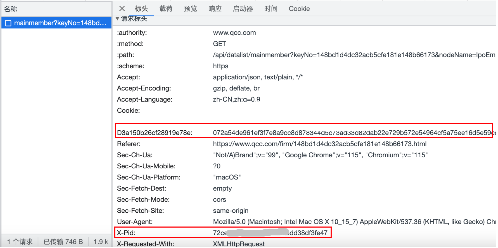


#### 2、逆向js

由于这个参数设置了headers的key和value，所以在代码里搜 **"headers["** 或者 **"headers."** 找到加密的位置。

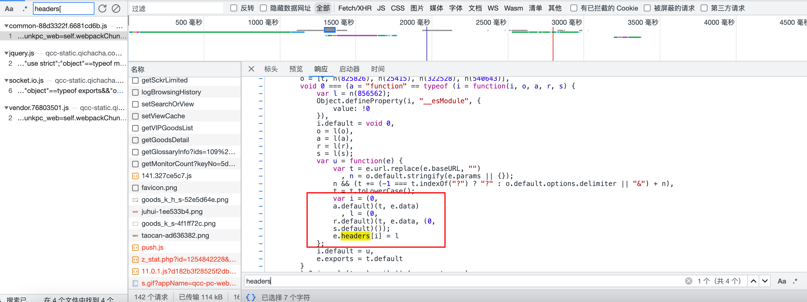

加密的位置就在这里，然后去扣所有的代码，最后会生成[js文件](./2023-8/spider_qichacha/qichacha_.js)，调用run方法即可生成接口参数。


#### 3、所需的参数

可以看到最后生成的方法中需要两个参数，一个是**path**，一个是**tid**，最后的**json_data**是post请求的参数。

```js
function run(path, tid, json_data){}
```


**path**：即请求的路径，例如请求接口：`https://www.qcc.com/api/datalist/mainmember?keyNo=....`，path参数即为`/api/datalist/mainmember?keyNo=....`

**tid**：tid在请求的页面中，可以使用正则表达式提取出来。

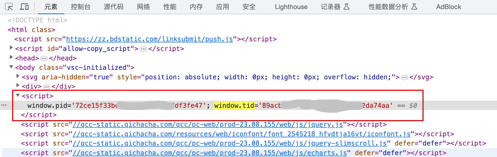


**pid**：就在tid旁边，这个参数放在headers里，key是**x-pid**

至此就可以对企查查的接口进行爬取。


#### 举两个例子

```python
import re

import execjs
import requests

# TODO 这里补充一下cookies
cookies = {
}


def build_api_headers(url, key_no, pid, tid, json_data=None):
    """
    构造请求头
    Args:
        url: 链接，包含参数
        key_no: 企业编号
        pid: 页面的加密参数pid
        tid: 页面的加密参数tid
        json_data: post请求的json数据
    Returns:
        response对象
    """
    headers = {'authority': 'www.qcc.com', 'accept': 'application/json, text/plain, */*',
               'accept-language': 'zh-CN,zh;q=0.9', 'cache-control': 'no-cache', 'content-type': 'application/json',
               'origin': 'https://www.qcc.com', 'pragma': 'no-cache',
               'sec-ch-ua': '"Not/A)Brand";v="99", "Google Chrome";v="115", "Chromium";v="115"',
               'sec-ch-ua-mobile': '?0', 'sec-ch-ua-platform': '"macOS"', 'sec-fetch-dest': 'empty',
               'sec-fetch-mode': 'cors', 'sec-fetch-site': 'same-origin',
               'user-agent': 'Mozilla/5.0 (Macintosh; Intel Mac OS X 10_15_7) AppleWebKit/537.36 (KHTML, like Gecko) Chrome/115.0.0.0 Safari/537.36',
               'x-requested-with': 'XMLHttpRequest', "referer": f'https://www.qcc.com/firm/{key_no}.html', 'x-pid': pid}

    # 正则取出'/api'及其后面的所有内容
    path = re.findall(r'(/api.*)', url)[0]

    print(f"path: {path}")
    # 执行qichacha.js中的run方法
    with open('./qichacha_.js', 'r', encoding='utf-8') as f:
        js = f.read()
    if json_data:
        ctx = execjs.compile(js).call('run', path, tid, json_data)
    else:
        ctx = execjs.compile(js).call('run', path, tid)
    # ctx是个字典，便利出所有的key和value，添加到headers中，不要覆盖原来的headers
    for k, v in ctx.items():
        headers[k] = v
    return headers


def post_api(url, key_no, pid, tid, json_data=None):
    """
    请求企查查api接口，post请求
    Args:
        url: 链接，包含参数
        key_no: 企业编号
        pid: 页面的加密参数pid
        tid: 页面的加密参数tid
        json_data: post请求的json数据
    Returns:
        response对象
    """
    headers = build_api_headers(url, key_no, pid, tid, json_data)

    response = requests.post(url, cookies=cookies, headers=headers, json=json_data)
    return response


def get_api(url, key_no, pid, tid, json_data=None):
    """
    get请求企查查api接口
    Args:
        url: 链接，包含参数
        key_no: 企业编号
        pid: 页面的加密参数pid
        tid: 页面的加密参数tid

    Returns:
        response对象
    """
    headers = build_api_headers(url, key_no, pid, tid, json_data)

    response = requests.get(url, cookies=cookies, headers=headers)
    return response


if __name__ == '__main__':
    # 以某企业为例
    key_no = '5dffb644394922f9073544a08f38be9f'
    pid = 'e19fd3c7ed52c1725cfff3226ba8af8c'
    tid = 'd471a1659954b0cf6eb558c770dfdb3b'

    # 请求可能需要会员，如果没有会员可以访问其他不需要会员的接口
    # get请求
    page_index = 1
    get_url = f'https://www.qcc.com/api/datalist/mainmember?keyNo={key_no}&nodeName=IpoEmployees&pageIndex={page_index}'
    main_member = get_api(get_url, key_no, pid, tid).json()
    print(main_member)

    # post请求
    post_url = 'https://www.qcc.com/api/datalist/financiallist'
    json_data = {
        'keyNo': '5dffb644394922f9073544a08f38be9f',
        'type': 'cm',
        'reportType': 1,
        'reportPeriodTypes': [
            0,
            4,
        ],
        'currency': '',
        'rate': 1,
    }
    financial = post_api(post_url, key_no, pid, tid, json_data=json_data).json()
    print(financial)

```


## 二、uyanip注册

url：https://www.uyanip.com/register

#### 注册流程

1、接收图片，识别出验证码，拿到Cookies

2、发送短信，拿到token

3、发送注册请求


#### 请求接口

##### 1、获取图片和Cookies

```python
def get_img():
    """
    获取验证码
    :return: 返回cookies和验证码
    """
    headers = {}  # 省略
  	response = requests.get('https://api.duyandb.com/auth/register/captcha', headers=headers)
    print(response.cookies)
    # 检查响应状态码是否为 200
    if response.status_code == 200:
        # 将响应的内容解析为图片
        image = Image.open(BytesIO(response.content))
        captcha_code = ocr.classification(image)
    else:
        print("请求失败，状态码：", response.status_code)
        return None
    # 这里的coockies用于下一次请求
    return {
        "cookies":response.cookies, "captcha_code":captcha_code
    }
```

##### 2、发送验证码

```python

def send_code(phone_number:str, captcha_code, cookies):
    """
    发送短信验证码
    :param phone_number: 手机号
    :param captcha_code: 图片验证码
    :param cookies: 图片验证码拿到的Cookies
    :return: {'data':'', 'errCode': 0}
    """
    """
    发送验证码
    :param phone_number: 手机号
    :return: {'data':'', 'errCode': 0}
    """
    headers={}  # 省略

    # 这里传入手机号和图片验证码
    json_data = {
        'value': phone_number,
        'captchaCode': captcha_code,
    }

    response = requests.post('https://api.duyandb.com/auth/register/smscode', cookies=cookies, headers=headers,
                             json=json_data)
    # 返回data和状态码，状态码为0则请求成功
    return response.json()
```


##### 3、发送注册请求

手机验证码发送成功后，就可以请求注册接口了

```python

def register(phone_number:str):
    """
    注册
    :param phone_number: 手机号 
    :return: 成功或None
    """
    headers = {}  # 省略
    
    # 获取图片验证码和Cookies
    img_obj = get_img()
    if img_obj:
        # 发送短信，返回token。验证码错误会失败
        code_obj = send_code(phone_number, img_obj['captcha_code'], img_obj["cookies"])
        if code_obj["errCode"] != 0:
            print(code_obj['data'])
            return None
        print(f"code_obj:{code_obj}")
        # 手机验证码
        phone_code = ''
        phone_code = input("请输入手机验证码：")

        json_data = {
            # 这里需要传入短信验证码接口返回的token
            'vtoken': code_obj['data'],
            # 手机号
            'phone': phone_number,
            # 手机短信验证码
            'smscode': phone_code,
            'password': 'mima123456',
            'confirmPassword': 'mima123456',
            # 随机用户名
            'nickname': generate_username(),
            'pinvitationCode': '',
            'type': 0,
        }
        # 发送注册请求
        response = requests.put('https://api.duyandb.com/auth/register/submit', headers=headers, json=json_data)
        # 成功会返回{'errCode':0, 'data': ''}
        return response.json()
```


##### 4、注册

如果你有短信验证码的接口这里可以进行批量注册。另外代码中没有添加代理，如果需要批量注册可能需要增加代理。

```python
if __name__ == '__main__':
    result = register('17118060285')
    if result and result.get('errCode') == 0:
        print("注册成功")
    else:
        print('注册失败，请重试')

```


## 三、凤凰云智管理平台（逆向登陆）

#### 数据接口

password是加密的

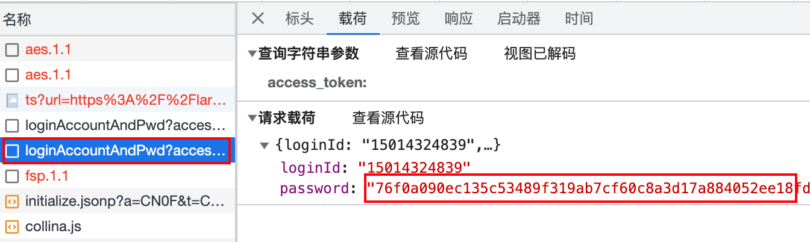


#### 加密的位置

使用xhr断点或者堆栈找到加密的位置

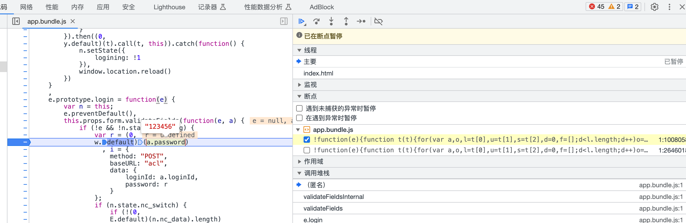

```js
// 加密的js代码
var i = r(n(2132));
i.default.setMaxDigits(130);
var c = new i.default.RSAKeyPair("10001","", s['prod']);
i.default.encryptedString(c, encodeURIComponent(e))
```

下面我们来补全这些代码


#### 还原js

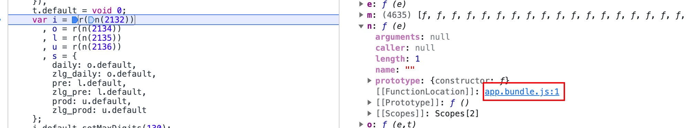


这里的n是加载器，下标2132这个方法就是i。

首先先把加载器的代码拿下来，然后再去找2132对应的方法，把方法放进数组里。


##### 1、加载器

点击n的位置跳转到代码，前面部分是加载器，后面是所有的方法。这里只拿加载器，就是最开头的部份，后面跟着的数组是方法。


##### 2、方法

下一部是把这个方法里的代码复制到加载器的数组里，

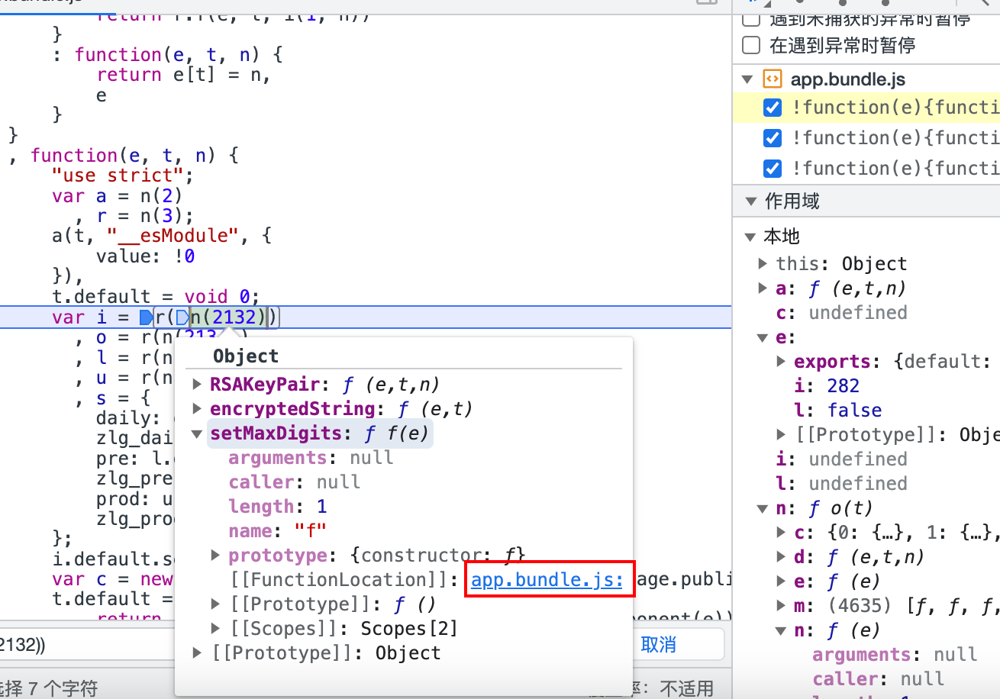


```js
// 全局变量
var loader;
// 加载器
!function(e){
  // ...
  // 里面的方法都赋值给了o，所以这里用全局变量接收o
  loader = o;
}([
  // 这里面放方法，这个代码在第二步里找
  function(e, t) {}
])

loader(0) // 这里就拿到了n(2132)对应的方法
```


##### 3、替换掉原来的参数

最终的js代码是这样的。[yuekeyun.js](2023-8/spider_yuekeyun/yuekeyun.js) 

```js
// 全局变量
var loader;
// 加载器
!function(e){
  // ...
  // 里面的方法都赋值给了o，所以这里用全局变量接收o
  loader = o;
}([
  // 这里面放方法，这个代码在第二步里找
  function(e, t) {}
])

// 公钥
s = {
    "prod": "837ec9791ee734418f44220b56cd22252c53309f59c560ff231d71e2579d38ea7a4408b017b1af85c6683111da151af25dddc53904a01e219bd56495a1add8cb70e54428bb87d95cd40478f6f800414be8a334ac779f4b819ae94fec240dc2ace1f99df64de88eef7bcbde4aabbdeac0e70a55e61331a9ea3d0546fe647977f9",
}

// loader(0)是RSA加密的函数
var i = loader(0);
function get_password(e) {
    i.setMaxDigits(130);
    var c = new i.RSAKeyPair("10001", "", s['prod']);
    // e参数是密码
    return i.encryptedString(c, encodeURIComponent(e));
}
```


## 四、boss直聘


### 接口和加密参数

```python
# 接口路径
url = 'https://www.zhipin.com/wapi/zpgeek/search/joblist.json'

cookies = {
		# 略
    # __zp_stoken__这个cookies就是加密的参数
    '__zp_stoken__': 'ad34eWCUTC1I3FyZ7fGIuWAAsARcpQh5BZiZBcEhYbzhQO28Xb3l%2FZkN0Om9sLyV5LXtlQGx3HWUkfTs3LEIocAZwThoHVhsNFVsdeAxUJTtfHCFwXzpxYkR0YGsoCAMyb0JXPz99EG9pPD4%3D',
}

headers = {
  # 略
}
params = {
  	# 略
  	# 关键词
    'query': 'python',
    'city': '101280600',
    'multiSubway': '',
    # 分页
    'page': '2',
    'pageSize': '30',
}

response = requests.get(url, params=params, cookies=cookies, headers=headers)
```


### 逆向js

[js代码](./2023-8/spider_boss/boss_zptoken.js)

##### 1、找js文件

通过关键字搜索 **\__zp_stoken__**，找到生成参数的js。

```js
// cookies的值
r = (new e).z(t, parseInt(n) + 60 * (480 + (new Date).getTimezoneOffset()) * 1e3)
```


##### 2、断点找加密的方法

通过搜索cookies加密的参数可以找到js文件，断点到加密的位置，把js文件复制下来。

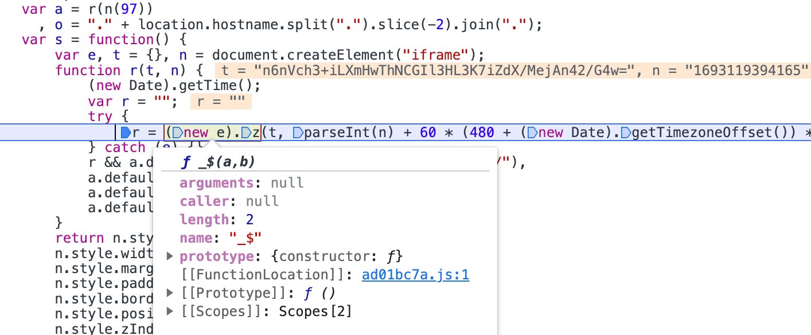


##### 3、调用的方法

调试后发现是在**window['ABD']\['prototype']**里，最后我们要调用的方法是：

```js
// seek和ts也在cookies中
window["ABC"]["prototype"].z(seek, ts)
```


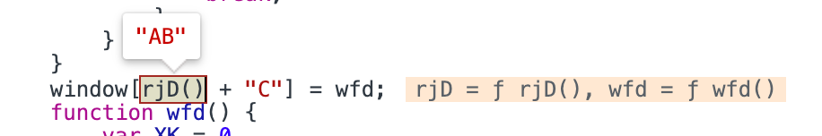

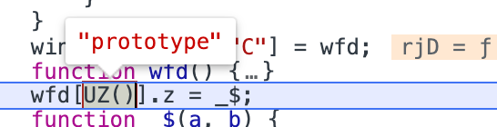


##### 4、js执行的问题

执行js的时候发现很多属性没有，这是很多环境不存在导致的，需要把环境补上。具体可查看代码

```js
const{JSDOM}=require("jsdom");
const dom = new JSDOM(`<!DOCTYPE html><p>Hello world</p>`, {
  url: 'https://www.zhipin.com/'
});

window=dom.window;
document=window.document;
navigator=window.navigator; 
location=window.location; 
history=window.history; 
screen=window.screen; 
```


##### 5、封装

```js
/**
 * 生成zp_token cookies参数
 * @param sseed cookies中的__zp_sseed__参数
 * @param sts cookies中的__zp_sts__参数
 * @returns __zp_token__ __zp_token__参数
 */
function get_zp_token(sseed, sts) {
    return window["ABC"]["prototype"].z(sseed, parseInt(sts) + 60 * (480 + (new Date).getTimezoneOffset()) * 1e3)
}
```


# 案例_2023-9

## 一、巨量算数

### 1、接口参数分析

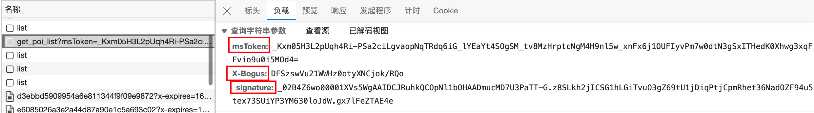


- **msToken**: 用于加密的参数，可以在**area**接口中获取
- **X-Bogus**: 加密生成的参数
- **_signature**: 加密生成的参数


### 2、逆向js

##### 2.1 添加XHR断点

可以添加X-Bogus或者__signature，这里以最后一个参数为例：

##### 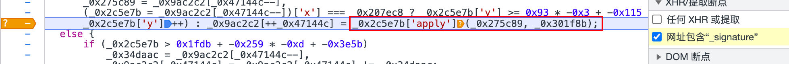


##### 2.2 添加条件断点

这里需要注意是添加到后面的方法上，不要直接添加在断点的位置（**添加到上图中红框黄色箭头的位置**）。

添加条件断点是因为这里会执行比较多的参数，我们只需要x-bogus和signature，根据返回的长度来决定是否debugger。**x-bogus会返回长度28的str，signature是147.**

```js
// _signature
_0x2c5e7b['apply'](_0x275c89, _0x301f8b).length === 147

// X-Bogus
_0x2c5e7b['apply'](_0x275c89, _0x301f8b).length === 28
```


##### 2.3 扣js

[巨量.js](2023-9/trendinsight/juliang.js)

断点后我们直接进入方法，在两个断点中可以分别查看看**方法和参数**，将所有代码扣下来，将两个加密的方法用变量接收，并且**补齐环境**，包括**document.cookie**。

```js
function get_param(msToken, url, body) {
    /**
     * 生成请求的参数
     * @type {string} msToken,X-Bogus,_signature
     */
    // body转为str
    body_str = JSON.stringify(body)
    xb = xb_func('msToken=' + msToken, body_str)
    return {
        'msToken': msToken,
        'X-Bogus': xb,
        '_signature': sign_func({
            'body': body,
            'url': url + 'msToken=' + msToken + '&X-Bogus=' + xb
        }, undefined, 'forreal')
    }
}
```


### 3、构造请求

这里分为两步：

1. 首先是**获取msToken**，在**area**这个接口中，**携带cookie**请求后即可获取；
2. 其次是接口数据获取，需要将msToken传入js文件中**生成x-bogus参数和signature参数**，然后发起请求。

**tips：**cookie具有时效性，如果请求失效或者signature的值错误，可能是cookie的问题。

[代码：](2023-9/trendinsight/juliang.py)

```python
import re

import execjs
import requests

cookies = {
		# ...
}


def get_ms_token() -> str:
    """
    获取msToken参数，需要cookies
    :return: msToken
    """
    headers = {
        # ...
    }

    params = {
        'dates': 'daily-20230831_weekly-20230827_monthly-202307',
        'area': '["11"]',
        'category_id': '1',
    }
		
    # 请求area接口，获取msToken
    response = requests.get('https://trendinsight.oceanengine.com/area', params=params, cookies=cookies,
                            headers=headers).text
    if 'msToken' in response:
        ms_token = re.search(r'msToken=(.*?);', response).group(1)
        return ms_token
    else:
        return ''


def get_poi_list() -> dict:
    """
    获取数据
    :return: json格式的数据
    """
    # 获取msToken
    ms_token = get_ms_token()
    if not ms_token:
        print("not msToken")
        return {}
    headers = {
        # ...
    }

    # 请求参数，根据需要调整
    json_data = {
			# ...
    }

    url = 'https://trendinsight.oceanengine.com/api/open/area/get_poi_list'

    # 读取./juliang.js调用get_params方法，获取两个加密参数
    with open('./juliang.js', 'r') as f:
        js_code = f.read()
        ctx = execjs.compile(js_code)
        params_dict = ctx.call('get_param', ms_token, url, json_data)
    x_bogus = params_dict['X-Bogus']
    _signature = params_dict['_signature']

    # 发起请求
    response = requests.post(
        f'{url}?msToken={ms_token}&X-Bogus={x_bogus}&_signature={_signature}',
        cookies=cookies,
        headers=headers,
        json=json_data,
    )
    return response.json()


if __name__ == '__main__':
    print(get_poi_list())

```


## 二、极验滑块

url：https://www.geetest.com/demo/slide-float.html

极验3滑块验证码，版本：7.9.1。

### 1、分析各请求

##### 1.1 获取gt、challenge参数：

https://www.geetest.com/demo/gt/register-slide?t=1694237711524

```js
// 响应
{
    "success": 1,
    "challenge": "18318454a32f0cfd280c5ba9d5f68fcd",
    "gt": "019924a82c70bb123aae90d483087f94",
    "new_captcha": true
}
```


##### 1.2 请求c、s参数

https://apiv6.geetest.com/get.php...

```js
{
    "status": "success",
    "data": {
        "c": [
            12,
            58,
            98,
            36,
            43,
            95,
            62,
            15,
            12
        ],
        "s": "61752c3a",
        // ...
    }
}
```


##### 1.3 取背景图和各种参数

https://api.geetest.com/get.php

```js
{
    "gt": "019924a82c70bb123aae90d483087f94",
    "challenge": "18318454a32f0cfd280c5ba9d5f68fcd8z",
    "id": "a18318454a32f0cfd280c5ba9d5f68fcd",
    "bg": "pictures/gt/cd0bbb6fe/bg/51e3c23b0.jpg",
    "fullbg": "pictures/gt/cd0bbb6fe/cd0bbb6fe.jpg",
    "height": 160,
    "slice": "pictures/gt/cd0bbb6fe/slice/51e3c23b0.png",
    "api_server": "https://api.geetest.com",
    "static_servers": [
        "static.geetest.com/",
        "dn-staticdown.qbox.me/"
    ],
    "c": [
        12,
        58,
        98,
        36,
        43,
        95,
        62,
        15,
        12
    ],
    "s": "51363072",
    "gct_path": "/static/js/gct.b71a9027509bc6bcfef9fc6a196424f5.js"
    // ...
}
```


### 2、生成w值

##### 2.1 验证码参数

通过轨迹和其他参数最终会生成w值。

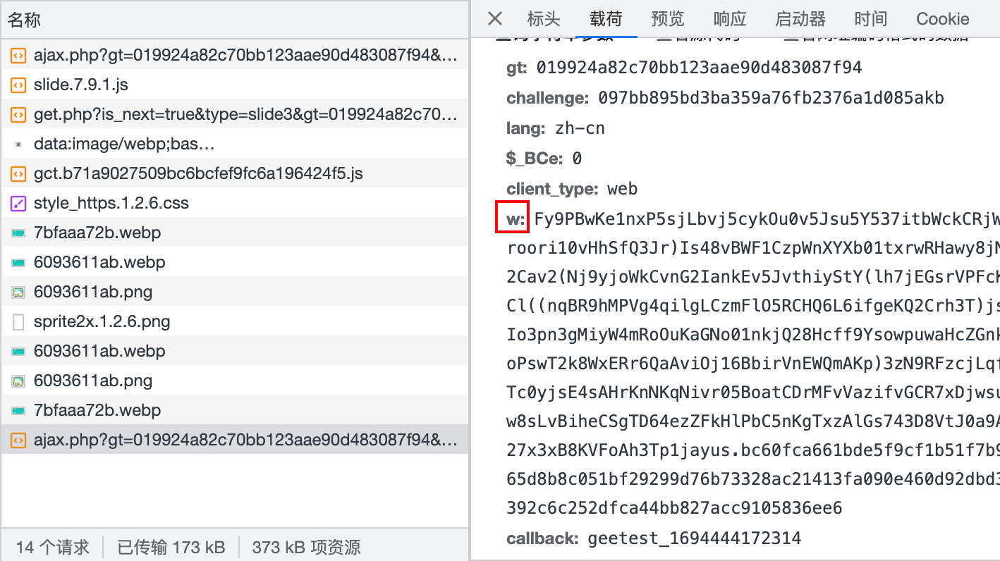


##### 2.2 找到对应的js

点击验证码会请求js文件，然后搜索w的unicode编码**"/u0077"**，可以找到代码。

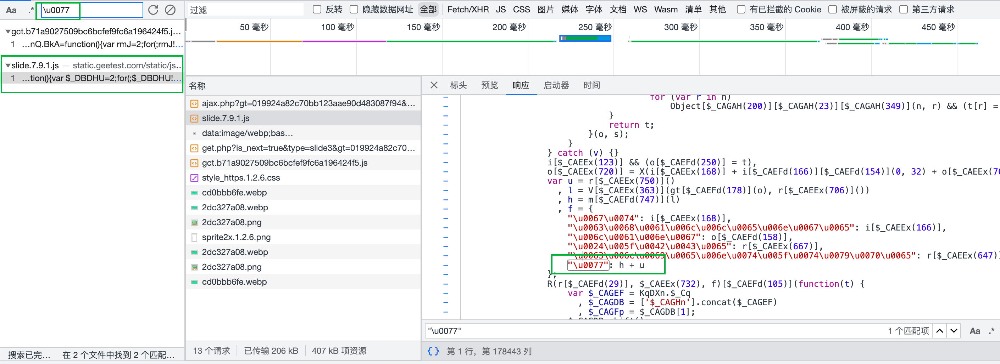


##### 2.3 关键参数

在这个js里会用到前面接口生成的**c、s、gt、challenge**，还需要**轨迹、滑动时间、滑动距离**。代码比较多比较杂，这里直接展示最终的参数生成代码，只需传入对应的参数。

```js
function generate_w(params){
    /**
     * 生成w, params需要传入distance, passtime, track, c, s, gt, challenge
     */
    var u = new U()["encrypt"](rt_)  // 这里的rt是一个随机值，但是需要和下面保持一致
    o = {
        "lang": "zh-cn",
        "userresponse": H(params['distance'], params['challenge']),  // 把滑动距离和challenge传入H函数，得到userresponse
        "passtime": params['passtime'],  // 滑动时间，要和轨迹里的滑动时间一致
        "imgload": 155,  // 加载时间，可以是随机值
        "aa": sign_aaa(params['track'], params['c'], params['s']),  // 传入轨迹、c、s，生成aa
        "ep": sign_ep(),  // 一些版本号(7.9.1)，时间等信息
        "h9s9": "1816378497",  // 固定值
        "rp": md5Hash(params['gt'] + params['challenge'].slice(0, 32) + params['passtime'])  // 传入gt、challenge、passtime，md5生成rp
    }
    var l = V['encrypt'](gt['stringify'](o), rt_)
    var h = m["$_FCp"](l)
    return h + u
}
```


### 3、需要注意的问题

##### 3.1 滑块距离

滑块可以使用ddddorc库进行识别，识别出来的**距离需要-10**，因为距离不是从最左侧开始计算的。


##### 3.2 请求的接口、参数

接口请求都需要访问一次，不然可能会报错，尤其是**get.php、ajax.php**等接口。

**challenge、gt、c、s**等参数都在接口中，需要注意参数可能变化，需要使用最新的值。


## 三、加速乐

url：aHR0cHM6Ly9iZWlhbi5taWl0Lmdvdi5jbi9pbmRleCMvSW50ZWdyYXRlZC9pbmRleA

### 1、分析请求

index页面一共会访问三次

#### 1.1 第一次请求

返回一段js代码，会生成**__jsl_clearance_s**的cookie参数。

请求中会返回**__jsluid_s**的cookie，可以使用session或者将这个值保存。


#### 1.2 第二次请求

携带前面生成的两个cookie参数，返回一段加密js代码。

代码使用了ob混淆，可以使用在线工具还原。https://ob.nightteam.cn/


一共有三份代码，分别是**sha1、sha256、md5**加密，将加密部分抽离即可。


js代码最后有一个json格式的参数，加密时需要用到，可以使用正则提取。

**ha**参数就是加密的方式。


#### 1.3 第三次请求

携带第二次js代码加密生成的cookie就可以获取到数据。


### 2、代码还原

使用chrome本地替换的方式对代码进行调试，还原过程比较简单。因为有三份加密代码，所以要将代码封装起来用参数判断，最后代码如下：

```js
_0x8b2003 = new Date(); 
function hash_md5(_0x4838bf){}
function hash_sha256(_0x14757c){}
function hash_sha1(_0xa1962c){}


function get_cookie(data) {
    _0x190080 = data
    // 判断加密参数
    if (data['ha']=='md5') {
        hash = hash_md5
    }else if (data['ha']=='sha1') {
        hash = hash_sha1
    }else if (data['ha']=='sha256') {
        hash = hash_sha256
    }else{
        throw new Error('hash not found')
    }

    function _0x247acb(_0x315328, _0x4b6f80) {
			// ... 略
      if (hash(_0x4e03cb) == _0x315328) {
        return [_0x4e03cb, new Date() - _0x8b2003];
      }

    }
    
    var cookie_value = _0x247acb(_0x190080['ct'], _0x190080["bts"]);
    
    return cookie_value
}
```


## 四、rpc实现js解密

### 1、介绍

rpc实现js解密的思路即在浏览器和本地之间实现websocket通信，本地远程调用浏览器的方法，返回函数的结果（加密函数等），即可获取页面的加密参数。

使用此方法可以快速解决部分反爬的问题，省去了扣js、补环境等操作。


### 2、实现步骤

##### 2.1 定义方法

**示例网站（Base64）：**aHR0cDovL3d3dy5mYW5nZGkuY29tLmNuL3NlcnZpY2UvYnVsbGV0aW5fbGlzdC5odG1sP3R5cGVhPTNiODgwMzdiYjhiM2Y5MDgmbmFtZT0lRTglQTElOEMlRTQlQjglOUElRTUlOEElQTglRTYlODAlODE=


在浏览器终端，通过断点调试的方式找到方法，然后将加密方法定义到windows中，方便调用。

```js
windows.my_crypto = _$vQ; // _$vQ为加密的方法，需要一个参数
```


##### 2.2 浏览器嵌入服务端代码

在终端中执行或者使用代码段等方式嵌入代码。

```js
!(function () {
    // 监听端口
    var ws = new WebSocket("ws://127.0.0.1:5678");  // 自定义端口

    ws.onmessage = function (evt) {
        console.log("receive msg: " + evt.data);
        // 退出
        if (evt.data === "quit") {
            ws.close();
        } else {
            // 调用方法，此处的my_crypto改为定义的函数名
            ws.send(my_crypto(evt.data))
        }
    };
})()
```


##### 2.3 python客户端调用

```python
import sys
import asyncio
import websockets


async def receive_massage(websocket):
    while True:
        # 输入参数
        send_text = input("Enter param please: ")
        if send_text == "quit":
            await websocket.send(send_text)
            await websocket.close()
            print('quit')
            sys.exit()
        else:
            # 发送参数
            await websocket.send(send_text)
            # 返回结果
            response_text = await websocket.recv()
            print("\n result：", response_text)


start_server = websockets.serve(receive_massage, '127.0.0.1', 5678)  # 自定义端口
asyncio.get_event_loop().run_until_complete(start_server)
asyncio.get_event_loop().run_forever()
```


##### 2.4 结果

输入参数，浏览器调用方法执行函数，返回结果

```
Enter param please: hello

result： http://www.xxxxxxx.com.cn/xxxxxx/hello?MmEwMD=4PCeybQd55uKYvUSSmDMRog5lWDWPHMOxmxIXWJlR55hSD_g1sJthJJJiTjbRm686KiRBYNY41.hVzO_6f1JmHlRl9d3h9HIgACnzKG5pcDI3NVYvoLoFjC2V.EolPuiI5rUi03HA1C32CKC2JMoteoVc.0IFoO_YL9_nSTo7I4jeEIObQr4XNjytzCPwl2C8ydfVBETAIdAiT5_2gAHrTUReojI7O.lr50sXQfusIkswqG1.4byu903XQju.VACsrgydmKPmXAQCQXQ7hfZjDwMS_UrVCB_pZptj.BJyDIK2w5HpCjxvBYYlcV5cfsI5JYThkZ2C8ANvIhOhtD1Dw6esCSVnc_F1YeHilQcqen9Gn9SSa.wB92txGz_rucFEE2a.oLL3XaRl7WFExc0suFrQwy.bqaxIhwKpbb9pLcPJX9UFu6PES_oM6_MPCwQrrvz
```

